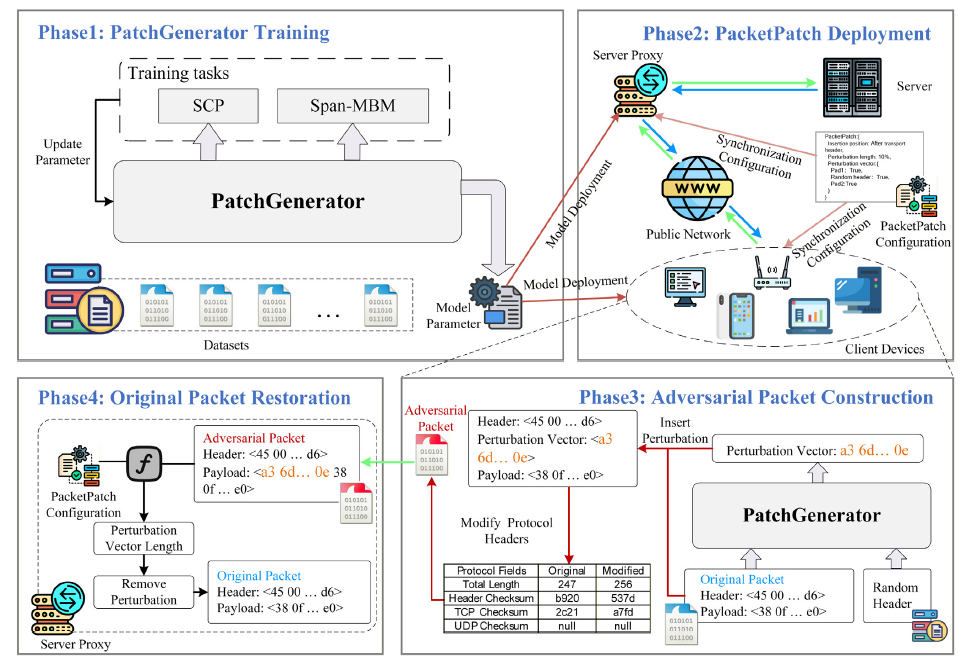

# PacketPatch: Practical Generation and Deployment of Adversarial Packets for Byte-Feature-Based Encrypted Traffic Classification

> **Paper**: PacketPatch: Practical Generation and Deployment of Adversarial Packets for Byte-Feature-Based Encrypted Traffic Classification
> **Authors**: Yuwei Xu, Yuanyuan Xu, Yunpeng Bai, Jiahui Chen, Kehui Song, Jie Cao, Qiao Xiang, Guang Cheng
> **Affiliation**: Southeast University, Purple Mountain Laboratories, Tiangong University, Queen's University, Xiamen University
> **Status**: Accepted/Under Review (Elsevier)

## Overview

PacketPatch is a practical scheme for generating adversarial network packets against **Byte-feature-based Encrypted Traffic Classification (B-ETC)** models, aiming to protect user privacy. Unlike existing methods that rely on unrealistic white-box assumptions or introduce excessive overhead, PacketPatch operates under strict **black-box** conditions while maintaining real-time performance and packet usability.

### Key Features

- **Black-Box Operation**: No access to target model gradients, parameters, or training data required
- **User-Agnostic**: Perturbation generation relies solely on current packet features, without user behavior history
- **Real-Time Efficiency**: Single forward pass generation, average latency ~10 ms per packet
- **Controllable Bandwidth Overhead**: Perturbation length ≤ 10% of original packet size
- **Packet Validity & Recovability**: Symmetric proxy architecture ensures packets pass integrity checks and can be perfectly restored at the receiver

## Architecture



### PatchGenerator Workflow

1. **Input Preparation**: Separate packet header from payload; prepare [MASK] tokens (length = 10% of packet size)
2. **Sequence Construction**: Assemble [CLS] + header + Pad1 + [SEP] + random_header(hr) + Pad2 + payload
3. **Perturbation Generation**: Single BERT forward pass → probability distributions over vocabulary
   - `Pad1` → **arg min** (maximally disrupts original features)
   - `Pad2` → **arg max** (generates features aligned with random header)
4. **Vector Assembly**: Final perturbation v = Pad1 + hr + Pad2

## Repository Structure

```
PacketPatch/
├── README.md                          # Project overview (this file)
├── LICENSE                            # MIT License
├── requirements.txt                   # Python dependencies
├── bert_base_config.json              # BERT model configuration (12 layers, 768-dim, 12 heads)
│
├── packet_adv/                        # ★ Core experimental code
│   ├── README.md                      # Usage guide for core modules
│   ├── adv_fine_tuning_cls.py         # Step 1: Train PatchGenerator (SpanBERT)
│   ├── generate.py                    # Step 2: Generate adversarial packets
│   └── gen_onnx.py                    # Step 3 (optional): ONNX/TensorRT acceleration
│
├── uer/                               # UER (Universal Encoder Representations) framework
│   ├── README.md                      # Framework documentation
│   ├── encoders/                      # Encoder implementations (Transformer, RNN, CNN)
│   ├── layers/                        # Network layers (Embedding, Attention, FFN)
│   ├── targets/                       # Training targets (MLM, NSP, Span-MBM, etc.)
│   ├── models/                        # Model definition
│   ├── utils/                         # Utilities (tokenizers, optimizers, data loading)
│   ├── model_builder.py               # Model construction
│   ├── model_loader.py                # Pretrained weight loading
│   ├── model_saver.py                 # Model checkpoint saving
│   ├── trainer.py                     # Training loop implementation
│   └── opts.py                        # CLI argument definitions
│
├── dataset/                           # Dataset documentation
│   └── README.md                      # Dataset descriptions, download links, preprocessing
│
├── image/                             # Architecture and result figures
│   └── README.md                      # Figure descriptions
│
└── tools/                             # Utility tools
    └── README.md                      # Tool descriptions and usage
```

## Quick Start

### 1. Environment Setup

```bash
# Clone this repository
git clone https://github.com/your-org/PacketPatch.git
cd PacketPatch

# Install dependencies
pip install -r requirements.txt
```

**Requirements**:

- Python 3.7+
- NVIDIA GPU with ≥6GB VRAM (recommended: RTX 3080 or above)
- 32GB+ system memory

### 2. Prepare Pretrained Model & Datasets

PacketPatch is built upon **ET-BERT**. Download the following from the [ET-BERT repository](https://github.com/linwhitehat/ET-BERT):

- `pretrained_model.bin` — ET-BERT pretrained weights
- `encryptd_vocab.txt` — Vocabulary file for byte-pair encoding

**Datasets**: We evaluate on three public datasets. See [dataset/README.md](dataset/README.md) for download links and preprocessing instructions.

| Dataset  | Classes | Scenario                 |
| -------- | ------- | ------------------------ |
| ISCX-TOR | 16      | Tor anonymous traffic    |
| ISCX-VPN | 11      | VPN encrypted tunnels    |
| USTC     | 20      | Malware + benign traffic |

### 3. Train PatchGenerator

```bash
cd packet_adv

# Edit adv_fine_tuning_cls.py first:
#   - Update dataset paths (lines 47-50)
#   - Update pretrained model path (lines 73-75)
#   - Set correct num_classes (line 56)
#   - Set correct training set size (line 878)

python adv_fine_tuning_cls.py
```

The trained checkpoint will be saved in the specified log directory (e.g., `span_2seg_cls_log/`).

### 4. Generate Adversarial Packets

```bash
cd packet_adv

# Edit generate.py first:
#   - Update test data paths (lines 42-44)
#   - Update --load_model_path to your trained checkpoint (line 68-69)
#   - Set BWO (bandwidth overhead ratio, line 60, default 0.1)
#   - Choose generation strategy via 'fun' parameter (line 50)

python generate.py
```

### 5. (Optional) Model Acceleration with TensorRT

```bash
cd packet_adv

# Edit gen_onnx.py first:
#   - Update model checkpoint path (line 132)
#   - Update output paths (lines 145, 207)
#   - Select precision mode: 'fp16' or 'int8' (line 21)

python gen_onnx.py
```

## Key Configuration Parameters

| Parameter         | File                   | Line  | Description               | Default           |
| ----------------- | ---------------------- | ----- | ------------------------- | ----------------- |
| `BWO`           | generate.py            | 60    | Bandwidth overhead ratio  | 0.1 (10%)         |
| `fun`           | generate.py            | 50    | Generation strategy       | 'fun5'            |
| `n_epochs`      | adv_fine_tuning_cls.py | 53    | Training epochs           | 50                |
| `batch_size`    | adv_fine_tuning_cls.py | 54    | Batch size                | 32                |
| `num_classes`   | adv_fine_tuning_cls.py | 56    | Number of traffic classes | Dataset-dependent |
| `learning_rate` | adv_fine_tuning_cls.py | 94-95 | Learning rate             | 2e-5              |
| `seq_length`    | adv_fine_tuning_cls.py | 92-93 | Input sequence length     | 256               |

### Generation Strategies (`fun` parameter)

| Strategy                     | Description                                                      |
| ---------------------------- | ---------------------------------------------------------------- |
| `fun1`                     | Single segment, argmin selection                                 |
| `fun2`                     | Dual segment, both argmax                                        |
| `fun3`                     | Dual segment, fixed 50/50 split, Pad1 argmin + Pad2 argmax       |
| `fun4`                     | Dual segment, random split, Pad1 argmin + Pad2 argmax            |
| **`fun5` (default)** | Dual segment with random dummy header, Pad1 argmin + Pad2 argmax |
| `fun6`                     | Dual segment with dummy header, NSP-guided strategy              |
| `random`                   | Random baseline                                                  |
| `random_dummy_head`        | Random header replacement baseline                               |
| `random_pad`               | Random padding baseline                                          |

## Training Tasks

PacketPatch's **PatchGenerator** is trained with two self-supervised tasks:

### SCP (Same Category Prediction)

Determines whether two input packets belong to the same traffic category. This equips the model with discriminative feature extraction capabilities.

**Loss**: Binary Cross-Entropy

### Span-MBM (Span Masked Byte Modeling)

Reconstructs consecutive masked byte spans using bidirectional context. This equips the model with context-aware byte sequence generation capabilities.

**Loss**: Negative Log-Likelihood
**Total Loss**: `Loss = Loss_SCP + Loss_Span-MBM`

## Results Summary

### Defense Effectiveness (DSR: Defense Success Rate)


### Time Overhead

| Stage                   | Time (ms/packet) |
| ----------------------- | ---------------- |
| Packet Preprocessing    | 0.054            |
| Perturbation Generation | 9.626            |
| Packet Reconstruction   | 0.398            |
| **Total**         | **10.078** |

PacketPatch outperforms the following white-box baseline methods under strict black-box assumptions:


## Citation

If you use PacketPatch in your research, please cite our paper:

```bibtex
@article{xu2025packetpatch,
    title = {PacketPatch: Practical Generation and Deployment of Adversarial Packets for Byte-Feature-Based Encrypted Traffic Classification},
    author = {Yuwei Xu and Yuanyuan Xu and Yunpeng Bai and Jiahui Chen and Kehui Song and Jie Cao and Qiao Xiang and Guang Cheng},
    journal = {Elsevier},
    year = {2025},
}
```

## License

This project is licensed under the MIT License — see the [LICENSE](LICENSE) file for details.

## Contact

For questions and inquiries, please contact the corresponding author or open an issue on GitHub.

- **Yuwei Xu** — xuyw@seu.edu.cn
- **Yuanyuan Xu** — xuyuanyuan@seu.edu.cn

## Acknowledgments

This project is built upon the [ET-BERT](https://github.com/linwhitehat/ET-BERT) framework, which provides the pretrained model and the UER (Universal Encoder Representations) training framework. We thank the ET-BERT authors for their valuable contributions.
